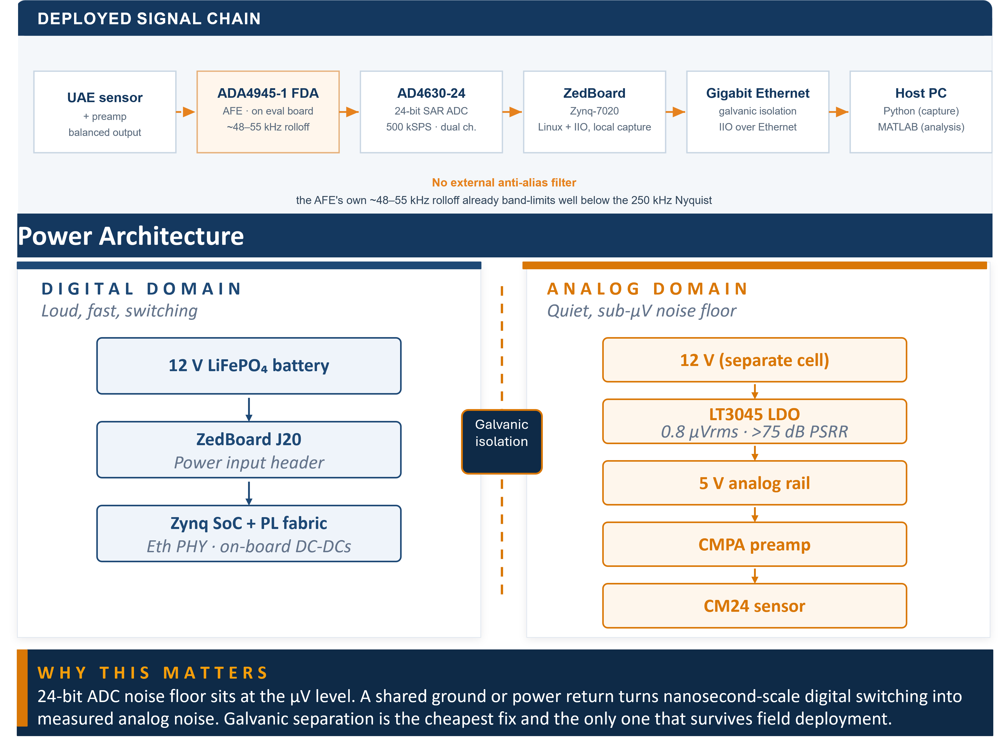
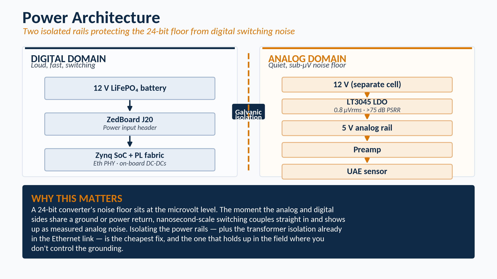

# Hardware architecture

This document describes the physical signal chain, the main hardware selections, and the power arrangement used in the data acquisition (DAQ) system. It is the hardware companion to the [system overview](01-system-overview.md).

The main design objective was to combine a high-resolution analog measurement path with an embedded controller that could operate reliably outside the laboratory. Particular attention was given to bandwidth, input configuration, power-supply noise, grounding, and electrical coupling to the host computer.

## Deployed signal chain

The deployed measurement chain is:

**Ultrasonic acoustic-emission sensor and preamplifier**  
→ **ADA4945-1 fully differential amplifier on the evaluation board**  
→ **AD4630-24 analog-to-digital converter**  
→ **Zynq-7020 programmable logic and embedded Linux**  
→ **local binary capture**  
→ **Ethernet file transfer**  
→ **Python and MATLAB analysis**

The chain can be divided into five main stages.

### 1. Sensor and preamplifier

The measurement source is an ultrasonic acoustic-emission (UAE) sensor with an external preamplifier. The sensor and preamplifier convert the measured mechanical response into an electrical signal suitable for the analog front end.

The source can be connected as a single-ended or differential signal, depending on the available sensor and preamplifier output. The input arrangement used during measurement must match the arrangement used during calibration. This includes:

- the driven input connector
- the grounded or terminated input
- the source impedance
- the cable arrangement
- the signal polarity convention

A change in this wiring can change the measured offset, gain, common-mode balance, or polarity.

### 2. Analog front end

The EVAL-AD4630-24FMCZ contains an ADA4945-1 fully differential amplifier. This amplifier forms the analog front end (AFE) between the external source and the AD4630-24 inputs.

The AFE performs two main functions:

1. It accepts the external single-ended or differential signal.
2. It drives the ADC inputs as a balanced differential signal.

The ADA4945-1 is part of every measurement taken with this configuration. Its gain, feedback network, loading, and frequency response therefore affect the complete acquisition path.

Testing showed that the AFE has a measurable low-pass response caused mainly by its feedback network. The measured rolloff is documented in [06, frequency rolloff investigation](06-frequency-rolloff-investigation.md).

### 3. Analog-to-digital converter

The AD4630-24 is a dual-channel, simultaneous-sampling, 24-bit successive approximation register (SAR) analog-to-digital converter (ADC).

The converter is capable of operating at up to 2 million samples per second (MSPS) per channel. The deployed system operates at 500 thousand samples per second (kSPS) per channel.

At 500 kSPS:

- the Nyquist frequency is 250 kHz
- both channels are sampled simultaneously
- each sample frame contains two 32-bit channel words
- the raw dual-channel data rate is 4 MB/s

The 500 kSPS operating point was selected and validated for the required acoustic and ultrasonic measurement band while keeping the capture size and processing requirements manageable.

### 4. Embedded controller

The EVAL-AD4630-24FMCZ connects to a Digilent ZedBoard through the field-programmable gate array (FPGA) Mezzanine Card (FMC) connector.

The ZedBoard contains a Xilinx Zynq-7020 system-on-chip (SoC). The device combines FPGA programmable logic with Arm processor cores.

The programmable logic receives the ADC data stream. The processor runs embedded Linux and controls the acquisition through the Industrial Input/Output (IIO) framework. Captured data is written locally before it is transferred to the host.

The project uses the Analog Devices Kuiper Linux image and the hardware description language (HDL), device-tree, and Linux-driver configuration supplied for this evaluation platform. No custom FPGA design is used.

### 5. Host computer

The completed binary capture is transferred to a laptop over Gigabit Ethernet.

The host-side responsibilities are divided between:

- **Python**, which controls the capture, transfers the data, checks file integrity, parses the binary file, and produces a quick measurement view
- **MATLAB**, which performs detailed signal analysis, system validation, and burst-quality assessment

The Ethernet connection also provides transformer isolation at the network interface. This helps reduce direct electrical coupling between the host computer and the DAQ.

## External anti-alias filter decision

A fourth-order Butterworth Sallen-Key low-pass filter was designed and built as a possible external anti-alias filter.

Its measured performance was:

- design cutoff frequency: 120 kHz
- measured -3 dB frequency: approximately 116.5 kHz
- passband flatness: approximately ±0.17 dB

The filter was successfully tested but was not included in the deployed signal chain.

The main reason was the measured response of the existing AFE. In the tested evaluation-board configuration, the ADA4945-1 path already begins to roll off at approximately 48 to 53 kHz. This is below the external filter cutoff and below the 250 kHz Nyquist frequency at the selected sample rate. The tested source also carries little energy in the higher-frequency region where aliasing would be a concern.

For the tested sensor, preamplifier, AFE, and measurement band, the external filter was therefore retained as an optional stage instead of being added to the normal hardware chain.

This decision is specific to the tested arrangement. It does not mean that an external anti-alias filter is unnecessary for every source. A new sensor or preamplifier should be evaluated using:

1. its useful signal bandwidth
2. its response above the intended measurement band
3. the attenuation provided by the complete analog chain
4. the selected ADC sample rate
5. the amount of out-of-band electrical noise

Digital compensation can correct measured in-band attenuation, but it cannot remove aliasing after sampling. Any out-of-band signal that has already folded into the sampled band is permanently mixed with the in-band data.

The filter design and test results are documented in [08, AA filter design](08-aa-filter-design.md).

## Component selection

| Stage | Selected component or method | Engineering reason |
|---|---|---|
| Sensor | UAE sensor with external preamplifier | Suitable for broadband transient and ultrasonic measurements, with low self-noise |
| Optional analog filter | Fourth-order Butterworth Sallen-Key filter using an LM4562NA | Designed and characterized as an optional anti-alias stage |
| Analog front end | ADA4945-1 on the evaluation board | Converts the external input to the differential signal required by the ADC |
| ADC | AD4630-24 | Dual-channel, 24-bit simultaneous sampling at up to 2 MSPS per channel |
| Embedded controller | Xilinx Zynq-7020 on the ZedBoard | Combines programmable logic, Arm processing, Linux, and IIO support |
| External preamplifier supply | Separate source with LT3045 regulation | Provides a low-noise supply for the sensor and preamplifier |
| Host connection | Gigabit Ethernet | Provides command control, file transfer, and transformer isolation at the network interface |

The component selections were not made from nominal ADC resolution alone. The useful system performance depends on the complete chain, including the sensor, preamplifier, AFE, voltage reference, power supplies, grounding, cabling, and host connection.

## Power architecture

The system uses two power domains:

1. the ZedBoard and evaluation-board domain
2. the external sensor and preamplifier domain

The purpose of this separation is to reduce the coupling of digital switching noise into the low-level sensor electronics.

### 1. ZedBoard and evaluation-board domain

A 12 V lithium iron phosphate (LiFePO4) battery powers the ZedBoard through the J20 barrel connector.

The AD4630 evaluation board is powered through the FMC connection to the ZedBoard. No separate power cable is used for the evaluation board.

This domain contains:

- the Zynq-7020 processor and programmable logic
- Double Data Rate 3 synchronous dynamic random-access memory (DDR3)
- Ethernet physical-layer (PHY) circuitry
- switching regulators
- the AD4630-24 ADC
- the on-board ADA4945-1 AFE

The evaluation board derives its required supply rails from the power available through the FMC connector. The ADC and AFE therefore share the ZedBoard-side power and ground domain on a common board ground plane.

### 2. Sensor and preamplifier domain

The external sensor and preamplifier use a separate supply followed by an LT3045 ultra-low-noise linear regulator.

The LT3045 was selected because it provides:

- approximately 0.8 µV root mean square (RMS) output noise
- more than 75 dB power-supply rejection ratio (PSRR) into the megahertz range
- a low-noise rail for the external sensor and preamplifier

The regulator output noise is below the measured noise floor of the complete converter and front-end chain.

The purpose of this supply arrangement is to prevent ZedBoard switching currents from directly sharing the sensor power rail. The ZedBoard contains several active digital loads, including the processor, programmable logic, DDR3 memory, Ethernet circuitry, and switching regulators. Keeping the sensor supply separate reduces a direct power-coupling path into the measurement signal.

## Isolation and grounding

The LT3045 is a low-noise regulator. It is not a galvanic isolator.

Whether the sensor supply and ZedBoard supply are electrically isolated depends on the complete wiring arrangement, including:

- signal returns
- cable shields
- connector grounds
- grounded laboratory instruments
- the Universal Serial Bus (USB) UART connection
- the host computer power connection

The main galvanic isolation between the DAQ and the host is provided by the Ethernet interface. The RJ-45 Ethernet magnetics provide approximately 1500 to 2500 V RMS isolation between the network sides.

This isolation benefit is lost if another conductive connection is present between the host and the DAQ. For example, leaving the USB-UART cable connected during a low-noise measurement can reconnect the host ground to the ZedBoard.

## Why the power arrangement matters

The useful noise floor of a high-resolution converter is affected by more than quantization. The measured result also includes:

- amplifier noise
- voltage-reference noise
- power-supply noise
- ground-loop current
- electromagnetic coupling
- cable motion and shielding
- digital switching current
- environmental interference

At microvolt signal levels, small grounding or supply problems can use a significant part of the available dynamic range.

The separate sensor supply reduces conducted switching noise from the digital electronics. Ethernet isolation reduces the host-ground coupling path. Careful cable routing and removal of unnecessary conductive host connections reduce the remaining coupling paths.

For the tested configuration, the measured performance was approximately:

- 20 µV RMS shorted-input noise
- 103.2 dB signal-to-noise ratio (SNR)
- 16.9 effective number of bits (ENOB)

The calibration and noise measurements are described in [05, calibration and voltage conversion](05-calibration-and-voltage-conversion.md).

## Hardware design summary

The final architecture separates the main engineering functions:

1. The sensor and preamplifier generate the measurement signal.
2. The ADA4945-1 AFE conditions the signal and drives the ADC.
3. The AD4630-24 samples both channels simultaneously.
4. The Zynq-7020 receives and stores the data.
5. Ethernet transfers the completed capture to the host.
6. Python controls acquisition and performs the initial checks.
7. MATLAB performs the detailed analysis.

The hardware was selected and arranged so that the acquisition path could be measured, calibrated, and operated as a complete instrument rather than treated as an ADC board alone.
