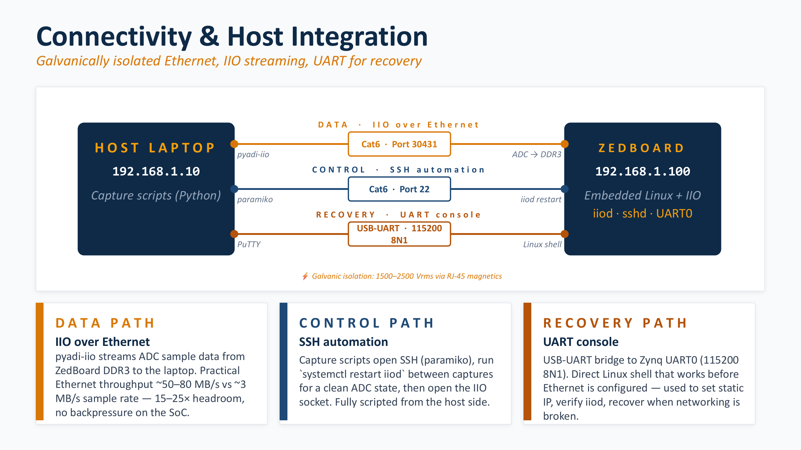

# Data Capture Workflow

This covers how a capture actually happens end to end: how the host talks to the ZedBoard, how samples get from the converter to a `.mat` file on the laptop, and one design decision about *what* gets saved that matters more than it looks. The script is [`scripts/start_daq_uae.py`](../scripts/start_daq_uae.py).



## Three links, three jobs

The host and the ZedBoard talk over three separate channels, each doing one thing:

- **Data — IIO over Ethernet.** Sample data moves over Gigabit Ethernet. Practical throughput is ~50–80 MB/s against a ~3 MB/s sample rate, so there's 15–25× headroom and the SoC never gets back-pressured.
- **Control — SSH.** The capture script drives everything over SSH (paramiko): it sets the sample rate, kicks off the capture, and pulls the file back. Fully scripted from the host side.
- **Recovery — UART.** A USB-UART bridge to the Zynq console (115200 8N1) gives a direct Linux shell that works before Ethernet is up. It's how you set the static IP and recover a board that won't come up on the network. Details in [03 — ZedBoard + ADC Setup](03-zedboard-adc-setup.md).

The whole link is galvanically isolated (1500–2500 Vrms through the RJ-45 magnetics), which is part of what keeps the digital side from leaking into the [analog noise floor](02-hardware-architecture.md#power-architecture).

## Capture, locally first

The key choice is that capture runs *on the ZedBoard*, not streamed live to the host. The script SSHes in and runs `iio_readdev` against the `ad4630-24` device, writing straight to a binary file in `/tmp`:

```
iio_attr -u local: -d ad4630-24 sampling_frequency 500000 && \
iio_readdev -u local: -b 200000 -s <N> ad4630-24 > /tmp/capture.bin
```

Capturing locally to DDR3/`/tmp` first, then transferring, means a momentary network hiccup can't drop samples mid-capture — the acquisition layer stays dead simple and the network only has to move a finished file. On the host side the capture runs in a thread with a progress bar so you can see it count down while you're striking.

Once the capture finishes, the file comes back over SFTP and gets parsed. Each sample is 8 bytes — two `int32` words, one per channel — with the signed 24-bit differential result living in the top 24 bits, so the parse is a reshape and an arithmetic shift:

```python
raw = np.fromfile(filepath, dtype=np.int32).reshape(-1, 2)
ch0_raw = raw[:, 0] >> 8        # signed 24-bit differential
ch1_raw = raw[:, 1] >> 8
```

Counts become volts with the per-channel calibration from [05 — Calibration and Noise](05-calibration-and-voltage-conversion.md): `V = GAIN · count + OFFSET`.

## What gets saved — and why it's only the raw counts

After parsing, the script applies the [Method B compensation](07-digital-compensation.md) and throws up a quick dual-channel Welch PSD so you can eyeball whether the capture is any good before moving on. But here's the part worth noticing: **the `.mat` file stores only the raw `int32` counts plus metadata.** The calibrated and compensated voltage arrays are deliberately *not* saved.

That sounds backwards — why recompute in MATLAB what Python already calculated? Because the raw counts are the only thing the hardware actually produced; everything else is derived. So the file saves:

- `ch0_raw`, `ch1_raw` — the source of truth
- the calibration constants (`gain_ch0/1`, `offset_ch0/1`)
- every compensation parameter (the sysid frequency and gain arrays, the `fc` values, the regularizer settings, a string naming the method)
- acquisition metadata (sample rate, duration)

With that, the MATLAB side reconstructs the calibrated and compensated signals byte-for-byte from raw counts plus metadata. The payoff is real: the files are smaller, there's no way for a saved "compensated" array to silently drift out of sync with the parameters that were supposed to have produced it, and if the compensator improves later, every old capture can be re-derived with the new method — nothing is baked in. The quick-look in Python and the deep analysis in MATLAB run the *same* math, so the glance you take in the field is the same signal you analyze later.

The PNG auto-save is intentionally commented out — this stage is a live quick-look, not a report generator. Figures come out of the MATLAB analysis instead.
