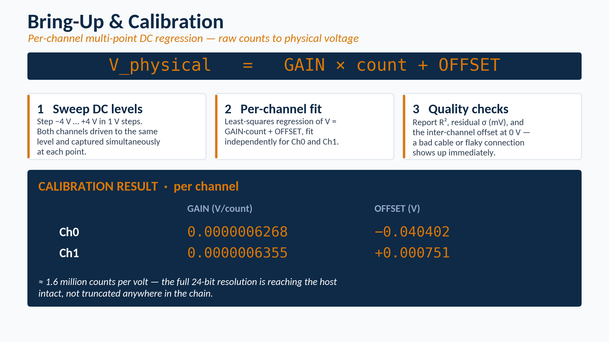
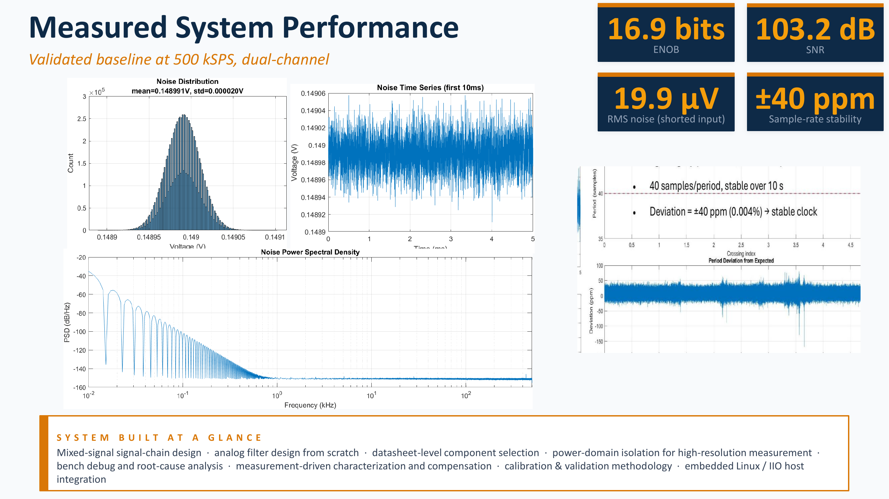

# Calibration and voltage conversion

This document describes how raw AD4630-24 analog-to-digital converter (ADC) counts are converted into voltage. It also summarizes the measured noise floor, signal-to-noise ratio (SNR), effective number of bits (ENOB), and sample-rate stability of the completed acquisition system.

The main dual-channel calibration script is [`scripts/calibrate_dual.py`](../scripts/calibrate_dual.py).

Calibration and noise characterization answer two different questions:

1. **Calibration:** What input voltage corresponds to a measured ADC count?
2. **Noise characterization:** How much of the nominal 24-bit range is usable in the completed system?

Both are required before the hardware can be treated as a measurement instrument rather than only a converter that produces integer values.

## Calibration model

The host receives a signed integer count from each ADC channel. A separate linear model is used to convert the counts from each channel into voltage:

```text
V = GAIN × count + OFFSET
```

where:

- `V` is the reconstructed input voltage
- `count` is the signed ADC output count
- `GAIN` is the voltage represented by one count
- `OFFSET` is the fitted voltage offset

The calibration is performed separately for Channel 0 and Channel 1 because the complete channel paths do not have exactly identical gain and offset.

## Calibration wiring

The dual-channel calibration uses two signal-generator outputs so that both ADC channels can be measured at the same applied direct-current (DC) voltage.

The wiring used during calibration was:

```text
Signal-generator Channel 1
    → AD4630 Channel 0 IN0+

AD4630 Channel 0 IN0-
    → evaluation-board ground

Signal-generator Channel 2
    → AD4630 Channel 1 IN1+

AD4630 Channel 1 IN1-
    → evaluation-board ground
```

Both signal-generator channels are configured for:

- DC output
- the same applied voltage at each step
- high-impedance load mode

This is a single-ended calibration arrangement. The wiring used during normal measurements should match the calibrated input arrangement, or the system should be recalibrated for the new arrangement.

The connector numbering can differ between evaluation-board revisions. Confirm the physical board revision and connector labels using [03, ZedBoard and ADC setup](03-zedboard-adc-setup.md#1-record-the-evaluation-board-revision).

## Why a multi-point calibration is used

An early calibration approach used two voltage points, typically +1 V and -1 V. Two points are sufficient to calculate the slope and intercept of a straight line, but they do not show whether the measured response is linear between those points.

The final procedure uses multiple DC levels:

```text
-4, -3, -2, -1, 0, +1, +2, +3, +4 V
```

At each level:

1. Set both signal-generator outputs to the same voltage.
2. Allow the output to settle.
3. Confirm the applied voltage.
4. Capture both ADC channels simultaneously.
5. Calculate the mean count for each channel.
6. Record the count standard deviation.
7. Continue to the next voltage level.

The mean count reduces the influence of random sample noise on each calibration point. The standard deviation provides a quick indication of measurement stability at that level.

After all levels have been measured, a least-squares linear regression is fitted separately to each channel.



## Least-squares fit

For each channel, the calibration script fits:

```text
applied voltage = GAIN × mean count + OFFSET
```

The fit produces:

- gain in volts per count
- offset in volts
- coefficient of determination, R²
- residual standard deviation
- estimated uncertainty of the fitted gain
- estimated uncertainty of the fitted offset
- residual at each applied voltage

The predicted voltage for calibration point `i` is:

```text
V_predicted,i = GAIN × count_i + OFFSET
```

The residual is:

```text
residual_i = V_applied,i - V_predicted,i
```

Residuals are reported in millivolts so that small deviations from the fitted line are easy to inspect.

## Why R² and residuals are reported

The coefficient of determination, R², indicates how closely the measured points follow the fitted straight line. A value close to 1 indicates that the linear model explains nearly all of the measured variation.

R² alone is not sufficient. A calibration can have a high R² while still containing one poor point or a small systematic curve. The point-by-point residuals are therefore also inspected.

The combined outputs help identify:

- an incorrectly entered voltage
- a poor cable or connector
- an unstable signal-generator output
- a clipped calibration point
- an unexpected change in gain
- a channel-specific offset
- nonlinearity over the tested range

The multi-point method provides a measured check of the conversion line instead of assuming linearity from only two endpoints.

## Measured calibration constants

The measured per-channel constants used in the current acquisition scripts are:

| Channel | Gain (V/count) | Offset (V) |
|---|---:|---:|
| Channel 0 | 0.0000006268 | -0.040402 |
| Channel 1 | 0.0000006355 | +0.000751 |

The conversion is therefore:

```text
Channel 0 voltage = Channel 0 count × 0.0000006268 - 0.040402

Channel 1 voltage = Channel 1 count × 0.0000006355 + 0.000751
```

A gain of approximately `6.3 × 10^-7 V/count` corresponds to approximately:

```text
1 / (6.3 × 10^-7) ≈ 1.6 million counts per volt
```

The measured scaling is consistent with a 24-bit converter operating over a several-volt input span. It also provides a practical check that the high-resolution ADC result is reaching the host without an obvious large scaling or truncation error.

## Channel offset comparison

Both channels are driven with the same voltage during the dual-channel calibration. This allows their reconstructed voltages to be compared directly.

At the 0 V calibration point, the script calculates the difference:

```text
Channel 0 reconstructed voltage - Channel 1 reconstructed voltage
```

This value provides a quick check of the relative offset between the two complete input paths.

The channel comparison is useful because each path includes its own:

- input connection
- analog front-end components
- ADC channel
- fitted gain
- fitted offset

The goal is not to force both calibration equations to be identical. The purpose is to measure and retain the small difference between them.

## Applying the calibration

The raw arrays are first converted from signed 32-bit integers to 64-bit floating-point values. The linear calibration is then applied:

```python
ch0_V = ch0_raw.astype(np.float64) * GAIN_CH0 + OFFSET_CH0
ch1_V = ch1_raw.astype(np.float64) * GAIN_CH1 + OFFSET_CH1
```

The original integer arrays are retained. The voltage arrays are derived values used for plotting, compensation, and analysis.

Each normal capture stores its own calibration metadata:

```text
gain_ch0
offset_ch0
gain_ch1
offset_ch1
```

The downstream MATLAB scripts prefer these per-capture values when they are available. This keeps the voltage reconstruction associated with the calibration constants that were active during acquisition.

The raw-data and metadata format is described in [04, data capture workflow](04-data-capture-workflow.md#saved-matlab-file).

## When recalibration is required

Recalibrate the system when a change can affect the electrical conversion between the source and the ADC counts.

Examples include:

1. changing the driven input connector
2. changing from single-ended to differential wiring
3. changing the termination or grounding arrangement
4. changing the analog front-end gain network
5. replacing or modifying the evaluation board
6. changing the signal source or preamplifier output configuration
7. observing an unexplained gain or offset change during validation

Calibration should also be rechecked after hardware repair, connector damage, or any modification to the analog path.

## Noise-floor measurement

The nominal ADC resolution is 24 bits, but the useful resolution of the completed system is lower because the measured output also contains noise from the full signal chain.

Noise contributions can include:

- ADC conversion noise
- analog front-end amplifier noise
- voltage-reference noise
- power-supply noise
- grounding and shielding effects
- cable pickup
- environmental electromagnetic interference

To measure the instrument noise floor, the analog inputs are shorted and a long capture is recorded with no applied signal.

The shorted-input capture represents the electrical output of the acquisition chain when the intended input signal is zero. It therefore provides a practical measurement of the system noise under the tested hardware, power, grounding, and cabling conditions.



## Validated noise results

The reported performance was measured using:

- dual-channel acquisition
- 500 kilosamples per second (kSPS) per channel
- a 10-million-sample capture
- shorted analog inputs

The measured results were:

| Parameter | Measured value |
|---|---:|
| Shorted-input root mean square noise | Approximately 19.9 µV RMS |
| Signal-to-noise ratio | 103.2 decibels (dB) |
| Effective number of bits | 16.9 bits |
| Sample-rate stability | Approximately ±40 parts per million |
| Percentage sample-rate stability | Approximately ±0.004% |

These values describe the complete tested acquisition system, not only the nominal ADC data-sheet performance.

## Root mean square noise

Root mean square (RMS) voltage is used to represent the effective magnitude of the measured noise:

```text
V_RMS = sqrt(mean(v^2))
```

For a zero-input capture, the mean value is removed as required before evaluating the alternating noise component.

The measured shorted-input result was approximately 19.9 µV RMS.

This value is more useful than the nominal least significant bit alone because it includes the electrical behavior of the complete measurement chain.

## Signal-to-noise ratio

The measured signal-to-noise ratio was approximately 103.2 dB.

SNR expresses the ratio between a reference signal level and the measured noise level on a logarithmic scale:

```text
SNR_dB = 20 log10(V_signal,RMS / V_noise,RMS)
```

A higher SNR means that a larger portion of the available measurement range can be distinguished above the system noise.

The reported SNR should be interpreted together with the configured input range, calibration, bandwidth, and measurement conditions.

## Effective number of bits

The effective number of bits represents the useful resolution indicated by the measured performance of the complete acquisition chain.

The measured system result is approximately 16.9 effective bits. This value includes the combined effects of the converter, analog front end, voltage reference, power supplies, grounding, and the rest of the signal path under the tested conditions.

The converter still produces a 24-bit output word. ENOB does not mean that the lower bits are removed. It means that noise limits the amount of independent voltage information that can be resolved to approximately 16.9 effective bits under the tested conditions.

For this reason, the project reports both:

- nominal converter resolution: 24 bits
- measured system resolution: approximately 16.9 effective bits

## Noise distribution and spectrum

The measured shorted-input noise was approximately Gaussian and broadly distributed across the frequency band.

This is preferable to a measurement dominated by:

- a strong periodic interference tone
- power-line pickup
- switching-regulator harmonics
- digital clock coupling
- a narrow mechanical or electrical resonance

A broadband noise floor is easier to characterize and less likely to create a false spectral feature at one specific frequency.

The result also supports the hardware decisions described in [02, hardware architecture](02-hardware-architecture.md), including the separate sensor supply, Ethernet host connection, and removal of unnecessary conductive host connections during low-noise measurements.

## Sample-rate stability

The measured sample-rate stability was approximately ±40 parts per million (ppm), equivalent to approximately ±0.004%.

Sample-rate stability is important because the time axis and frequency axis are calculated from the sample interval.

A sample-rate error affects:

- the frequency assigned to a spectral peak
- the duration assigned to a transient
- phase accumulation over a long record
- coherent sinusoidal measurements
- comparisons between separate captures

The measured stability indicates that the sampling clock remained sufficiently consistent for the frequency-domain measurements performed in this project.

## Instrument noise and site noise

Two different noise measurements are used in the project.

### 1. Instrument noise

Instrument noise is measured with the ADC inputs shorted. It characterizes the acquisition system itself under the tested electrical setup.

The approximately 19.9 µV RMS value reported in this document is an instrument-noise measurement.

### 2. Site noise

Site noise is measured with the sensors and preamplifiers operating in the actual measurement environment, but with no intended impact or excitation.

It can include:

- ambient vibration
- machinery
- electrical interference
- sensor coupling noise
- preamplifier noise
- cable motion
- unrelated transient events

Site noise can change between locations and measurement sessions. It is therefore measured separately and used to set the burst-detection and quality thresholds.

The site-noise procedure is described in [10, burst-quality pipeline](10-burst-quality-pipeline.md).

## Calibration and validation summary

The voltage and noise characterization process establishes the following:

1. Raw Channel 0 and Channel 1 counts are converted using separate linear equations.
2. The calibration is based on multiple applied DC levels rather than only two endpoints.
3. R² and residuals are used to check the fitted conversion.
4. Calibration constants are stored with every normal capture.
5. The shorted-input noise of the tested system is approximately 19.9 µV RMS.
6. The measured SNR is approximately 103.2 dB.
7. The measured ENOB is approximately 16.9 bits.
8. The sample rate is stable to approximately ±40 ppm.
9. Instrument noise is kept separate from site-dependent environmental noise.

The next part of the project investigates the measured high-frequency attenuation of the analog front end. See [06, frequency rolloff investigation](06-frequency-rolloff-investigation.md).
