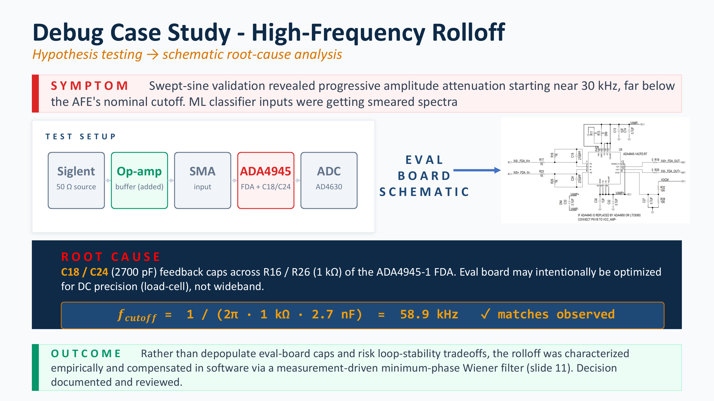

# Frequency rolloff investigation

This document describes an unexpected high-frequency amplitude loss found during validation of the complete acquisition chain. It explains how the response was measured, how the evaluation-board schematic was used to identify the dominant cause, and why the final correction was implemented in software instead of modifying the hardware.

The correction method is described in [07, digital compensation](07-digital-compensation.md).



## Observed symptom

During swept-sine testing, the measured amplitude began to decrease near 30 kHz. This was lower than expected for the intended measurement bandwidth.

The behavior was not a sudden cutoff. The attenuation increased gradually with frequency:

**low-frequency input amplitude**  
→ **increasing attenuation above approximately 30 kHz**  
→ **reduced high-frequency content at the analog-to-digital converter (ADC) output**

This matters because the system is intended to measure broadband and transient signals. If the analog front end attenuates part of the useful band, the recorded waveform no longer has the same relative spectral content as the physical input.

For example, a transient may still be clearly visible in the time domain while its higher-frequency components are reduced. A later classifier or spectral analysis could then interpret the event differently even though no obvious acquisition error was reported.

The rolloff therefore had to be:

1. measured over the intended frequency range
2. separated from source and cabling effects
3. compared with the evaluation-board circuit
4. corrected only after its behavior was understood

## Investigation approach

The rolloff was treated as a system-identification problem rather than as a single faulty measurement.

A sinusoidal input was applied at a sequence of known frequencies. The input amplitude was held constant while the output amplitude measured by the data-acquisition system was recorded.

The system-identification sweep uses 24 frequencies from 1 kHz to 120 kHz. Each channel is tested separately so that Channel 0 and Channel 1 receive independent response measurements.

The measurement path was:

```text
Siglent signal generator, 50 ohm source
    → added unity-gain operational-amplifier buffer
    → SubMiniature version A (SMA) input
    → ADA4945-1 fully differential amplifier (FDA) and its feedback network
    → AD4630-24 analog-to-digital converter
    → ZedBoard capture
```

The frequency-sweep acquisition is implemented in [`scripts/freq_sweep_sysid_dual.py`](../scripts/freq_sweep_sysid_dual.py). The captured waveforms are analyzed using [`scripts/sysid_analysis_dual.m`](../scripts/sysid_analysis_dual.m).

## Why the input buffer was added

The signal generator has a nominal 50 ohm output impedance. Cabling, adapters, and the evaluation-board input network can interact with that impedance.

If the sweep had been performed using only the signal generator, a measured amplitude change could have come from:

- the signal generator
- cable loading
- the evaluation-board input impedance
- the ADA4945-1 analog front end
- a combination of these effects

A unity-gain operational-amplifier buffer was therefore placed between the signal generator and the evaluation board.

The buffer provides a low and more clearly defined source impedance. This does not remove every possible cable or parasitic effect, but it reduces source loading as an uncontrolled variable. The remaining measured response is then more representative of the evaluation-board signal path.

## Per-channel sweep procedure

The sweep is performed separately for each ADC channel.

1. Connect the buffered signal-generator output to the selected channel.
2. Leave the unused channel input arrangement as specified by the test procedure.
3. Set the sinusoidal input to the required amplitude.
4. Apply the first test frequency.
5. Allow the generator output and analog path to settle.
6. Capture the selected channel at 500 kilosamples per second (kSPS).
7. Repeat the capture three times at that frequency.
8. Continue through all 24 frequencies from 1 kHz to 120 kHz.
9. Save the raw waveforms and acquisition metadata.
10. Repeat the complete procedure for the other channel.

The analysis script converts the raw counts to voltage and estimates the sinusoidal amplitude using three methods:

- coherent lock-in projection at the commanded frequency
- a windowed Fast Fourier Transform (FFT) peak
- a least-squares sinusoidal fit

The methods provide a cross-check on the measured response. The script also examines repeat-to-repeat variation and displays selected time-domain waveforms so that clipping, distortion, missing signals, or unexpected direct-current offsets can be identified.

## Measured response

The measured response was broadly similar to a first-order low-pass response, with a dominant pole in the approximately 48 to 55 kHz region. The exact fitted value changes slightly with the channel, wiring, and cabling arrangement.

However, the response was not a perfect textbook single-pole curve.

Two features were important:

1. a shallow plateau from approximately 30 to 42 kHz
2. a dip or non-monotonic region near approximately 90 to 100 kHz

A one-pole model captures the overall downward trend, but it cannot reproduce these local features.

This distinction affected the correction method. A parametric one-pole inverse could correct the main slope, but it would leave residual amplitude error in the plateau and dip regions. The final correction therefore had to follow the measured response rather than only the fitted cutoff frequency.

## Comparison with the schematic

After the approximate pole frequency was established, the evaluation-board schematic was examined for a corresponding resistor-capacitor network.

The dominant candidate was the feedback network around the ADA4945-1 fully differential amplifier (FDA):

- feedback capacitors `C18` and `C24`: 2700 picofarads (pF)
- feedback resistors `R16` and `R26`: nominally 1 kilohm (kΩ)

Each feedback resistor and capacitor forms a first-order low-pass contribution. Using the nominal values:

```text
f_cutoff = 1 / (2πRC)

f_cutoff = 1 / (2π × 1 kΩ × 2.7 nF)

f_cutoff ≈ 58.9 kHz
```

The schematic estimate of approximately 59 kHz is close to the measured dominant pole of approximately 48 to 55 kHz.

The remaining difference can reasonably include:

- resistor and capacitor tolerance
- channel-to-channel component variation
- cable capacitance
- connector and printed-circuit-board parasitics
- loading from the complete input arrangement

The comparison does not require the measured response to match the simple resistor-capacitor calculation exactly. The calculation identifies the expected dominant bandwidth limitation, while the sweep measures the behavior of the complete assembled signal path.

## Root-cause conclusion

The investigation identified the ADA4945-1 feedback network as the dominant source of the measured rolloff.

The component selection is reasonable for applications that prioritize direct-current precision and noise reduction. Limiting the analog bandwidth reduces wideband noise entering the converter.

For the present application, however, useful acoustic and transient information extends into the same frequency region. The existing bandwidth limitation therefore attenuates signal content that must be recovered during later processing.

The measured local plateau and dip indicate that the complete response also includes effects beyond the simple nominal resistor-capacitor pole. This is why the measured per-channel response is retained for compensation.

## Correction options considered

Two possible solutions were considered.

### 1. Hardware modification

The first option was to depopulate feedback capacitors `C18` and `C24`.

Removing these capacitors would move or remove the dominant low-pass contribution. It could provide a wider raw analog bandwidth.

This option was not selected because:

- the capacitors are part of the FDA feedback and compensation network
- removing them may affect amplifier stability
- the modification would change the evaluation board from its documented configuration
- small surface-mount rework increases the risk of board damage
- modified boards would be harder to reproduce and replace in the field
- the complete response would still need to be measured after modification

The hardware route was therefore considered possible, but not the preferred solution for this build.

### 2. Measured digital compensation

The selected option was to:

1. leave the evaluation-board hardware unchanged
2. measure the response of each channel
3. construct a stable inverse from the measured response
4. apply the inverse during post-processing

This approach keeps the hardware stock and reproducible. It also corrects the behavior that was actually measured, including the local features that a nominal one-pole model cannot reproduce.

## Limits of the selected approach

Digital compensation does not create information that was never captured.

It can correct a known in-band attenuation when:

- the signal remains above the system noise
- the analog path remains linear
- the response is sufficiently stable between characterization and measurement
- the correction gain is constrained to prevent excessive noise amplification

It cannot:

- recover a component that was completely removed by the analog path
- undo clipping or saturation
- remove aliasing after out-of-band content has already folded into the sampled band
- compensate accurately if the analog hardware changes without being re-characterized

For this reason, the compensation uses Wiener regularization and a high-frequency soft wall. The implementation is described in [07, digital compensation](07-digital-compensation.md).

## Engineering decision

The final decision was:

**retain the stock evaluation-board front end**  
→ **measure each channel independently**  
→ **use the measured magnitude response**  
→ **reconstruct the corresponding minimum-phase model**  
→ **apply a regularized digital inverse**

This decision was based on:

- hardware stability
- repeatability between systems
- reduced rework risk
- measured rather than assumed behavior
- the ability to preserve the original raw ADC data

## Investigation summary

1. The unexpected attenuation became visible near 30 kHz.
2. The complete response was measured from 1 kHz to 120 kHz.
3. An input buffer was used to reduce source-impedance uncertainty.
4. The dominant measured pole was approximately 48 to 55 kHz.
5. The measured response also contained a plateau near 30 to 42 kHz and a dip near 90 to 100 kHz.
6. The evaluation-board schematic identified the 2700 pF feedback capacitors and nominal 1 kΩ feedback resistors as the dominant bandwidth-limiting network.
7. The nominal resistor-capacitor calculation gives approximately 58.9 kHz, which is consistent with the measured response of the complete system.
8. Hardware depopulation was rejected because of stability, reproducibility, and rework concerns.
9. The final system uses measured, per-channel digital compensation.
