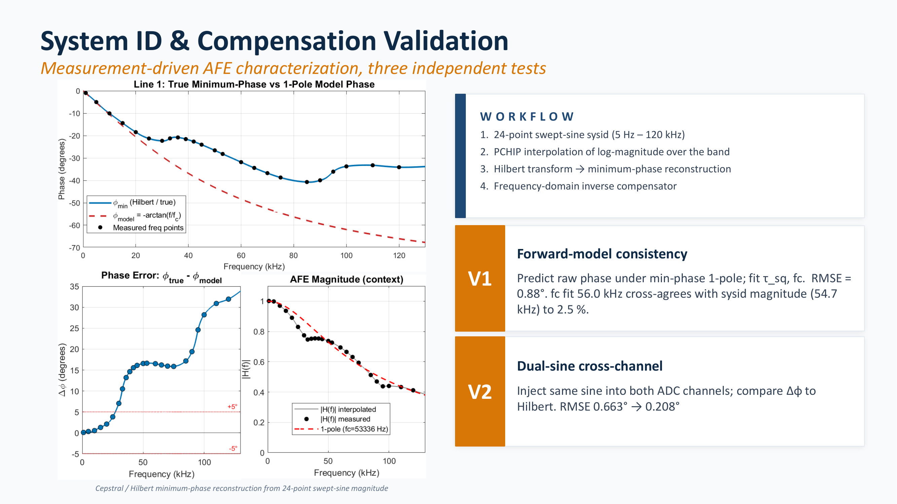
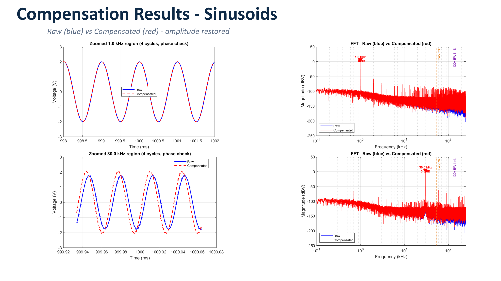
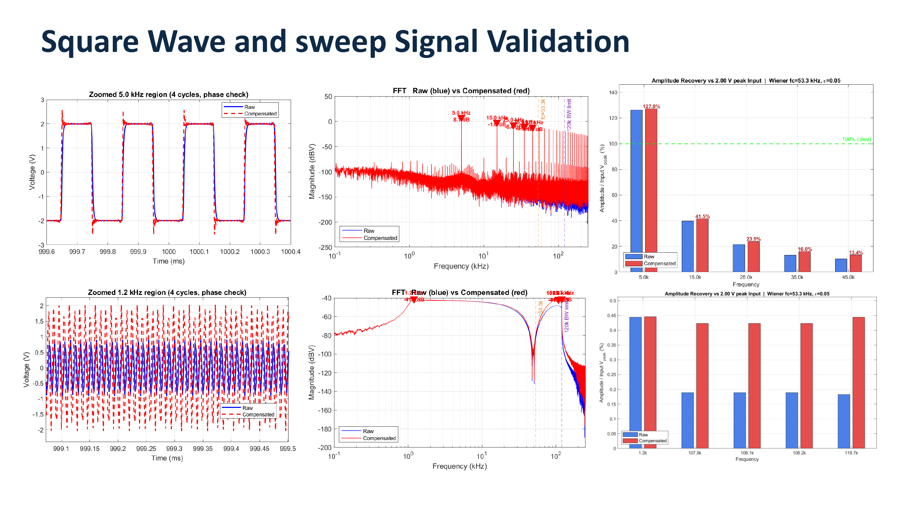

# Digital compensation

The [frequency rolloff investigation](06-frequency-rolloff-investigation.md) showed that the analog front end (AFE) ahead of the AD4630 analog-to-digital converter (ADC) attenuates useful signal content above approximately 30 kHz. The dominant pole is in the approximately 48 to 55 kHz region, but the measured response also contains features that are not represented by a simple one-pole model.

This document describes the digital correction used to recover the measured in-band response. The method is called **Method B** in the project scripts.

The Python implementation is in [`scripts/start_daq_uae.py`](../scripts/start_daq_uae.py). The same Method B formulation is also used by the MATLAB analysis and burst-quality processing so that quick-look and detailed analysis follow the same correction method.

## Compensation objective

The analog path can be represented by a complex frequency response:

```text
H_AFE(f) = |H_AFE(f)| × exp(jφ(f))
```

where:

- `|H_AFE(f)|` is the measured magnitude response
- `φ(f)` is the phase response
- `j` is the imaginary unit
- `f` is frequency

The purpose of the compensator is to construct a correction response `G(f)` such that:

```text
H_AFE(f) × G(f) ≈ 1
```

over the useful measurement band.

An ideal inverse would restore both:

- amplitude, by reversing the measured attenuation
- phase, by reversing the corresponding analog phase shift

The inverse must also remain bounded at high frequencies, where the analog response is small and noise amplification would otherwise become excessive.

## First approach: parametric one-pole inverse

The first approach was to model the AFE as a first-order low-pass response:

```text
|H(f)| = 1 / sqrt(1 + (f / f_c)^2)
```

where `f_c` is the fitted cutoff frequency.

The inverse of this model is simple to calculate. It corrects the overall rolloff slope and requires only a fitted gain and cutoff frequency.

However, the measured response contains:

1. a shallow plateau from approximately 30 to 42 kHz
2. a dip or non-monotonic region near approximately 90 to 100 kHz

A one-pole model cannot reproduce either feature. Its inverse therefore corrects the broad trend but leaves frequency-dependent residual error.

The parametric method was useful as an initial model and as an extrapolation tool above the measured range, but it was not selected as the final in-band correction.

## Selected approach: Method B

Method B is a non-parametric Wiener deconvolution based on the measured per-channel magnitude response and a reconstructed minimum-phase response.

The complete processing path is:

**measured per-channel magnitude**  
→ **interpolation on the capture frequency grid**  
→ **minimum-phase reconstruction**  
→ **complex AFE model**  
→ **regularized Wiener inverse**  
→ **frequency-domain multiplication**  
→ **compensated time-domain signal**

Each ADC channel uses its own measured gain values because the two analog paths are similar but not identical.

## 1. Measure the per-channel magnitude response

The system-identification sweep contains 24 frequency points from 1 kHz to 120 kHz.

At each frequency:

1. a sinusoidal signal with known amplitude is applied
2. the active channel is captured three times
3. the raw ADC counts are converted to calibrated voltage
4. the measured output amplitude is estimated
5. the gain ratio is calculated

The gain ratio is:

```text
|H(f)| = measured output peak / applied input peak
```

The resulting Channel 0 and Channel 1 gain arrays are stored separately in the processing scripts and in normal-capture metadata.

## 2. Build the magnitude response on the FFT grid

The measured response contains only 24 frequency points, but a captured waveform has many Fast Fourier Transform (FFT) bins. The measured response must therefore be evaluated on the exact frequency grid of the captured signal.

The implementation uses three frequency regions.

### Below the first measured frequency

At direct current (DC) and below the first 1 kHz measurement, the magnitude is set to unity:

```text
|H(f)| = 1
```

### Within the measured range

From 1 kHz to 120 kHz, the logarithm of the measured magnitude is interpolated using a Piecewise Cubic Hermite Interpolating Polynomial (PCHIP).

```text
log(|H(f)|)
    → PCHIP interpolation
    → exp(interpolated value)
```

Log-domain interpolation is used because gain changes are naturally multiplicative. PCHIP also preserves the local shape of the data without the large overshoot that can occur with an unconstrained cubic spline.

### Above the measured range

Above 120 kHz, the response is extrapolated using a one-pole model anchored to the final measured gain value.

The implementation uses:

| Parameter | Channel 0 | Channel 1 |
|---|---:|---:|
| One-pole extrapolation cutoff | 48,149 Hz | 48,674 Hz |

The one-pole function is used only to continue the response beyond the measured range. The measured PCHIP response remains the basis of the correction from 1 kHz to 120 kHz.

The magnitude is also limited to a small positive value so that a numerical zero cannot enter the later logarithm or inverse calculation.

## 3. Reconstruct the phase

The system-identification sweep measures amplitude but does not provide a common trigger reference for direct phase measurement.

Method B therefore assumes that the measured analog response can be represented as a stable minimum-phase system over the correction band. Under this assumption, the phase is related to the logarithm of the magnitude.

The implementation reconstructs the phase using the real cepstrum:

1. build a full symmetric log-magnitude spectrum
2. calculate the inverse Fast Fourier Transform (IFFT)
3. apply a causal cepstral window
4. calculate the FFT of the windowed cepstrum
5. take the angle of the reconstructed minimum-phase spectrum

In compact form:

```text
log magnitude
    → real cepstrum
    → causal cepstral window
    → reconstructed minimum-phase spectrum
    → phase φ(f)
```

This is the numerical implementation of the minimum-phase relationship between log magnitude and phase. It produces a phase vector on the same frequency grid as the magnitude model.

The complete complex AFE model is then:

```text
H_AFE(f) = |H_AFE(f)| × exp(jφ(f))
```

## 4. Form a regularized inverse

A direct inverse would be:

```text
G_direct(f) = 1 / H_AFE(f)
```

This becomes unsafe where `|H_AFE(f)|` is small. At those frequencies, the inverse gain becomes large and amplifies measurement noise, quantization noise, and any model error.

Method B uses the Wiener form:

```text
G(f) = conj(H_AFE(f)) / (|H_AFE(f)|^2 + ε(f))
```

where:

- `conj(H_AFE(f))` is the complex conjugate of the AFE model
- `|H_AFE(f)|^2` is the squared magnitude
- `ε(f)` is the frequency-dependent regularization term

When the measured response is strong:

```text
|H_AFE(f)|^2 >> ε(f)
```

the result approaches the normal inverse.

When the measured response is weak:

```text
|H_AFE(f)|^2 << ε(f)
```

the regularization term limits the correction gain.

## Frequency-dependent regularization

The regularizer is:

```text
ε(f) = ε_floor + ε_wall × 0.5 × [1 + tanh((f - f_edge) / Δf)]
```

The implemented parameters are:

| Parameter | Value | Purpose |
|---|---:|---|
| `EPS_FLOOR` | `1e-4` | Keeps the in-band inverse finite |
| `EPS_WALL` | `50` | Strongly suppresses correction above the usable band |
| `F_EDGE` | `135000 Hz` | Center of the high-frequency soft wall |
| `DF_TRANS` | `3000 Hz` | Transition half-width |

At lower frequencies, `ε(f)` remains close to the small floor value. The compensator can therefore restore the measured attenuation.

Near 135 kHz, the hyperbolic tangent term increases smoothly. The inverse gain is then reduced rather than being stopped by a hard discontinuity.

The soft transition avoids a sharp frequency-domain edge, which could produce unnecessary time-domain ringing.

## 5. Apply the compensator

The compensator is built directly on the native frequency grid of each captured waveform.

For a signal of length `N`:

1. calculate the real-input FFT using `rfft`
2. calculate the corresponding frequency vector using `rfftfreq`
3. construct the measured magnitude on that exact grid
4. reconstruct the minimum phase
5. calculate the Wiener inverse
6. multiply the signal spectrum by the inverse
7. return to the time domain using `irfft`

The processing equation is:

```text
X_comp(f) = X(f) × G(f)
```

followed by:

```text
x_comp(t) = irfft(X_comp(f))
```

The complete capture is processed in one operation. The implementation does not use:

- block processing
- overlap-save processing
- overlap-add processing
- a second interpolation of the completed compensator

This avoids block-boundary artifacts and ensures that the AFE model is evaluated directly on the same grid as the signal spectrum.

## This is not anti-aliasing

The 135 kHz soft wall limits the digital correction and prevents excessive out-of-band noise amplification. It is not an analog anti-alias filter.

The sequence is important:

**analog signal**  
→ **analog front-end bandwidth limitation**  
→ **ADC sampling and possible aliasing**  
→ **digital compensation**

Once an out-of-band component has folded into the sampled frequency band, a digital filter cannot determine its original frequency and remove it reliably.

Anti-aliasing must therefore be provided by the analog response before the ADC. In the deployed configuration, the measured AFE rolloff and the limited source bandwidth provide the relevant analog band limitation. The optional external filter is documented in [08, anti-alias filter design](08-aa-filter-design.md).

## Validation

The phase reconstruction and correction were checked using three independent approaches.



### 1. Forward-model consistency

The raw phase was predicted using a minimum-phase one-pole representation. Fitting the time constant and cutoff produced approximately 0.9 degrees root mean square (RMS) phase error.

The cutoff obtained from this phase-based check agreed with the cutoff inferred independently from the magnitude sweep to within a few percent.

This indicates that the measured magnitude and the minimum-phase interpretation are consistent with each other.

### 2. Cross-channel comparison

The same sinusoidal input was applied to both channels. The measured inter-channel phase difference was compared with the difference predicted by the reconstructed channel models.

The agreement was well below one degree.

This check is useful because the channels have independent measured magnitude arrays and independent phase reconstructions.

### 3. External reference instrument

The compensated output was also compared with a separate commercial data-acquisition instrument recording the same input.

This is an external validation rather than only a self-consistency check. The large reference datasets used for this comparison are not committed to the repository.

## Time-domain and frequency-domain results



The sinusoidal tests show two expected behaviors:

1. A 1 kHz signal lies within the flat part of the measured response and is left almost unchanged.
2. A 30 kHz signal lies within the beginning of the rolloff and has its amplitude restored while the phase follows the input cycle.



The square-wave and swept-sine tests provide broader checks:

- square-wave edges become sharper as attenuated harmonic content is restored
- swept-sine recovery moves the measured amplitude toward the applied amplitude across the characterized band
- the largest correction occurs where the AFE caused the greatest attenuation
- the low-frequency region remains close to its original amplitude

## Practical limits

Method B depends on the measured system remaining representative of the system used during later captures.

The system should be re-characterized if any of the following changes:

1. evaluation-board analog components
2. input wiring or termination
3. sensor or preamplifier
4. cable type or cable length when it affects the response
5. ADC sample rate
6. analog gain configuration

The correction should also be interpreted only within the measured and validated bandwidth. A large calculated inverse gain does not prove that useful signal information exists at that frequency.

## Compensation summary

1. A one-pole inverse was rejected as the final in-band correction because it cannot reproduce the measured plateau and dip.
2. Each channel uses its own 24-point magnitude response from 1 kHz to 120 kHz.
3. The measured magnitude is interpolated in the log domain using PCHIP.
4. A one-pole model is used only for extrapolation above the measured range.
5. Phase is reconstructed using a real-cepstrum minimum-phase method.
6. The complex response is inverted using a frequency-dependent Wiener regularizer.
7. A soft wall centered at 135 kHz prevents excessive high-frequency correction.
8. The complete waveform is processed using one FFT and one inverse FFT.
9. The soft wall is not anti-aliasing.
10. Validation used forward-model consistency, cross-channel comparison, and an external reference instrument.
