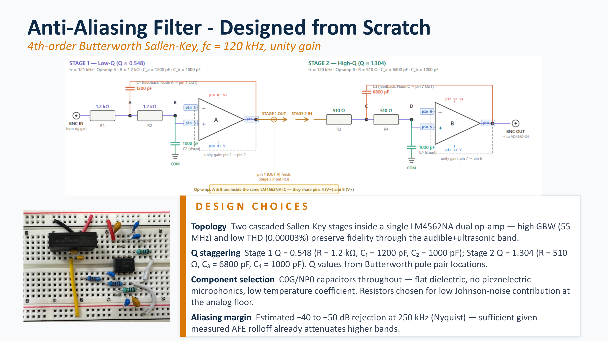
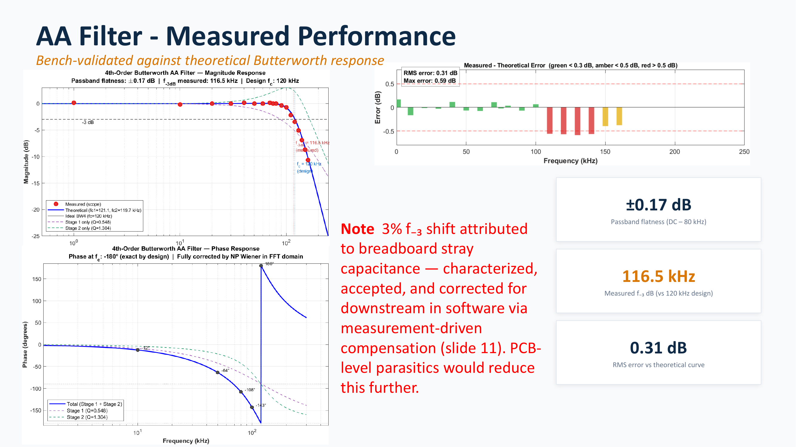

# Anti-alias filter design

This document describes a fourth-order Butterworth anti-alias low-pass filter that was designed, built, and tested during development of the acquisition system.

The filter met its design objective, but it is not installed in the deployed signal chain. Later characterization showed that the AD4630 evaluation board's own analog front end (AFE) already limits the bandwidth well below the external filter's cutoff frequency.

The decision not to deploy the filter does not invalidate the design. The filter remains a tested optional stage for a future source or front end with a wider analog bandwidth.

The system-level decision is also discussed in [02, hardware architecture](02-hardware-architecture.md#external-anti-alias-filter-decision). The measured evaluation-board rolloff is described in [06, frequency rolloff investigation](06-frequency-rolloff-investigation.md).

## Design objective

The original objective was to limit analog content before it reached the analog-to-digital converter (ADC).

The normal operating rate is 500 kilosamples per second (kSPS). At this rate:

```text
sample rate = 500 kSPS

Nyquist frequency = sample rate / 2

Nyquist frequency = 250 kHz
```

The selected external filter target was:

- fourth-order low-pass response
- Butterworth alignment
- 120 kHz cutoff frequency
- unity passband gain
- two cascaded second-order Sallen-Key stages
- one LM4562NA dual operational amplifier

The intended path was:

**sensor or signal source**  
→ **external fourth-order low-pass filter**  
→ **evaluation-board AFE**  
→ **AD4630-24 ADC**

## Why a Butterworth response was selected

A Butterworth filter has a maximally flat magnitude response in the passband. It does not introduce intentional passband ripple.

This was suitable for the intended measurement because the useful signal amplitudes should remain as uniform as practical through the passband.

The design tradeoff is that a Butterworth filter does not have the fastest possible transition from passband to stopband. Other responses can provide a steeper transition or a more linear phase, but they introduce different compromises.

For this filter, the priorities were:

1. flat passband magnitude
2. moderate circuit complexity
3. unity gain
4. practical component values
5. a repeatable fourth-order response

## Fourth-order implementation

A fourth-order Butterworth response is implemented as two cascaded second-order stages.

The two stages do not have the same quality factor `Q`. Their pole locations must be selected as a pair to produce the complete Butterworth response.

The implemented stages were:

| Stage | Quality factor, Q | Resistors | Capacitors |
|---|---:|---:|---:|
| Stage 1, low Q | 0.548 | `R = 1.2 kΩ` | `C1 = 1200 pF`, `C2 = 1000 pF` |
| Stage 2, high Q | 1.304 | `R = 510 Ω` | `C3 = 6800 pF`, `C4 = 1000 pF` |

The stages are connected in cascade:

```text
input
    → Stage 1, Q = 0.548
    → Stage 2, Q = 1.304
    → filtered output
```

The order of the stages was selected as low Q followed by high Q. Each stage operates at unity gain.



## Operational-amplifier selection

The filter uses one LM4562NA dual operational amplifier. One amplifier section is used for each Sallen-Key stage.

Relevant stated characteristics include:

- gain-bandwidth product: approximately 55 MHz
- total harmonic distortion (THD): approximately 0.00003%
- two amplifier channels in one package

The operational-amplifier bandwidth is much higher than the 120 kHz filter cutoff. This reduces the influence of finite open-loop gain on the intended response.

The low distortion is also appropriate for measurements where added harmonic content could be mistaken for part of the source signal.

## Capacitor selection

The filter uses C0G/NP0 ceramic capacitors.

C0G and NP0 are designations for a temperature-stable, low-loss ceramic dielectric class. These capacitors were selected because they have:

- low capacitance change with temperature
- low voltage dependence
- low dielectric absorption
- low loss
- negligible piezoelectric microphonic behavior compared with less stable ceramic dielectrics

The capacitors directly determine the filter pole locations and quality factors. A capacitance change therefore changes the frequency response.

This is particularly relevant in a measurement system exposed to:

- temperature changes
- mechanical vibration
- long operating periods
- small signal levels

## Resistor selection

The resistor values were kept relatively low.

Lower resistance reduces resistor thermal noise and reduces sensitivity to small parasitic input currents and capacitances. The values still remain high enough to avoid placing an unnecessary load on the signal source or the operational amplifier.

The selected resistor and capacitor values were a practical compromise between:

- required cutoff frequency
- required stage Q
- standard component availability
- thermal-noise contribution
- operational-amplifier drive requirements
- breadboard parasitic capacitance

## Bench construction

The filter was assembled on a solderless breadboard for initial validation.

This build method is convenient for changing components, but it introduces non-ideal effects:

- stray capacitance between rows and conductors
- longer signal and ground paths
- larger loop areas
- less controlled grounding
- greater coupling between stages

These effects are more important at ultrasonic frequencies than they are in a low-frequency direct-current circuit.

The breadboard build was therefore treated as a prototype used to check the design response, not as the final physical implementation for deployment.

## Measurement procedure

The completed filter was tested using a swept sinusoidal input.

1. Apply a constant-amplitude sine wave to the filter input.
2. Sweep the input frequency through the passband and transition region.
3. Measure the filter output amplitude.
4. Calculate the measured gain at each frequency.
5. Compare the measured response with the theoretical fourth-order Butterworth response.
6. Identify the measured passband variation and the measured minus 3 decibel (dB) point.
7. Calculate the root mean square error between measurement and theory.

The measured result was then plotted with the theoretical response.



## Measured performance

The bench results were:

| Measurement | Result |
|---|---:|
| Design cutoff frequency | 120 kHz |
| Passband flatness from direct current (DC) to 80 kHz | ±0.17 dB |
| Measured minus 3 decibel frequency | 116.5 kHz |
| Root mean square error relative to theory | 0.31 dB |

The measured cutoff was approximately 3% below the design target:

```text
cutoff shift = (120 kHz - 116.5 kHz) / 120 kHz

cutoff shift ≈ 2.9%
```

This agreement is acceptable for a breadboard implementation at the tested frequency.

## Difference between measurement and theory

The measured response follows the theoretical Butterworth shape closely, but the minus 3 decibel point moved from the 120 kHz design target to approximately 116.5 kHz.

The most likely contribution is stray breadboard capacitance added to the designed capacitor values.

Additional capacitance lowers the pole frequencies:

```text
larger effective capacitance
    → lower stage pole frequency
    → lower complete-filter cutoff frequency
```

Component tolerance and wiring parasitics can also contribute.

The shift was characterized and accepted rather than corrected on the breadboard. A printed-circuit-board implementation with shorter traces and controlled parasitics would be expected to follow the design values more closely.

## Why the filter is not deployed

After this filter was built, the evaluation-board AFE was characterized independently.

That investigation found:

- attenuation becomes noticeable near 30 kHz
- the dominant AFE pole is approximately 48 to 55 kHz
- the external filter cutoff is approximately 116.5 kHz as built
- the Nyquist frequency is 250 kHz at the 500 kSPS operating rate

The resulting order of bandwidth limitations is:

```text
evaluation-board AFE rolloff, approximately 48 to 55 kHz
    → optional external filter cutoff, approximately 116.5 kHz
    → ADC Nyquist frequency, 250 kHz
```

The existing AFE becomes the dominant analog bandwidth limit before the optional filter reaches its cutoff region.

The tested source also contains little energy in the higher-frequency region where aliasing would otherwise be a concern. For the tested sensor, preamplifier, AFE, wiring, and sample rate, the external filter would not provide a useful additional system-level benefit.

It was therefore left out of the deployed chain.

## Relationship to digital compensation

The AFE rolloff inside the useful measurement band is corrected digitally using the method described in [07, digital compensation](07-digital-compensation.md).

Digital compensation and anti-alias filtering perform different functions:

| Function | Where it occurs | Purpose |
|---|---|---|
| Analog anti-alias filtering | Before ADC sampling | Attenuates content that could fold into the sampled band |
| Digital compensation | After ADC sampling | Corrects known attenuation and phase behavior in captured in-band data |

Digital compensation cannot replace a required analog anti-alias filter. It cannot undo frequency folding that occurred during sampling.

The decision not to use this external filter is based on the measured band limitation already present in the tested analog chain. It is not based on the availability of digital compensation.

## When the filter may be required

The external filter should be reconsidered if the analog chain changes.

Examples include:

1. replacing the evaluation-board AFE with a wider-band driver
2. removing or changing the ADA4945-1 feedback capacitors
3. using a sensor or preamplifier with significant energy above the intended measurement band
4. reducing the ADC sample rate
5. operating in an environment with strong high-frequency electrical interference
6. connecting a different signal source whose out-of-band response has not been characterized

In these cases, the full analog response must be compared with the selected sample rate and Nyquist frequency.

## Design outcome

The filter development produced three useful outcomes:

1. A fourth-order Butterworth response was designed from two second-order pole pairs.
2. Practical components were selected with bandwidth, distortion, noise, dielectric stability, and parasitic effects in mind.
3. The breadboard measurement agreed with theory to 0.31 dB root mean square error and produced a measured cutoff within approximately 3% of the target.

The decision not to install the filter was made after measuring the complete acquisition chain. The filter remains documented as a validated optional design rather than being included only because it had already been built.

## Filter summary

1. The filter is a fourth-order, unity-gain Butterworth low-pass design.
2. The design cutoff is 120 kHz.
3. It uses two cascaded Sallen-Key stages with Q values of 0.548 and 1.304.
4. Both stages are implemented using one LM4562NA dual operational amplifier.
5. C0G/NP0 capacitors were selected for dielectric stability and low microphonic behavior.
6. The measured passband flatness is approximately ±0.17 dB from DC to 80 kHz.
7. The measured minus 3 decibel frequency is approximately 116.5 kHz.
8. The measured root mean square error relative to theory is approximately 0.31 dB.
9. The approximately 3% cutoff shift is consistent with a breadboard build and added parasitic capacitance.
10. The filter is not installed because the tested evaluation-board AFE already provides the dominant analog bandwidth limitation.
